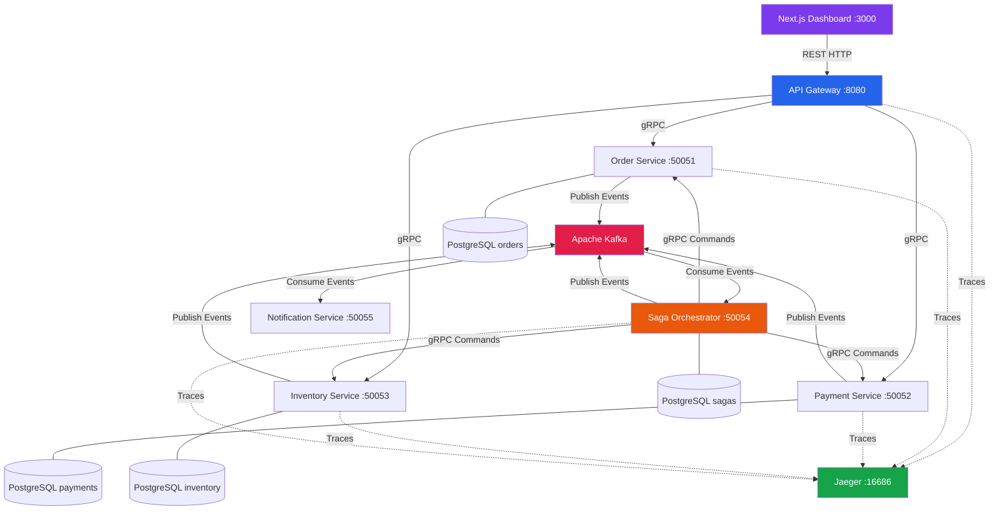
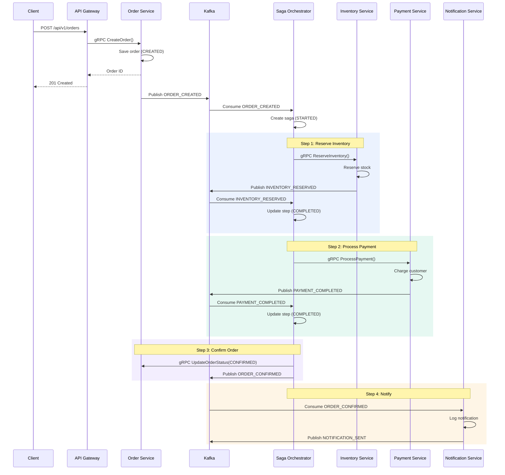
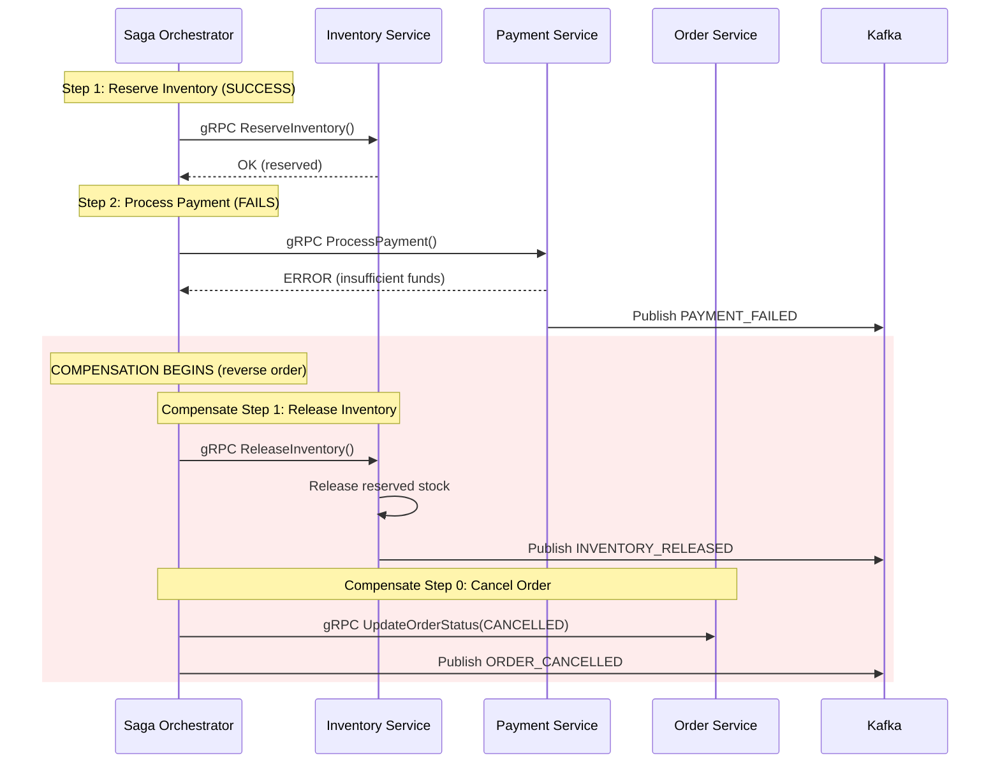
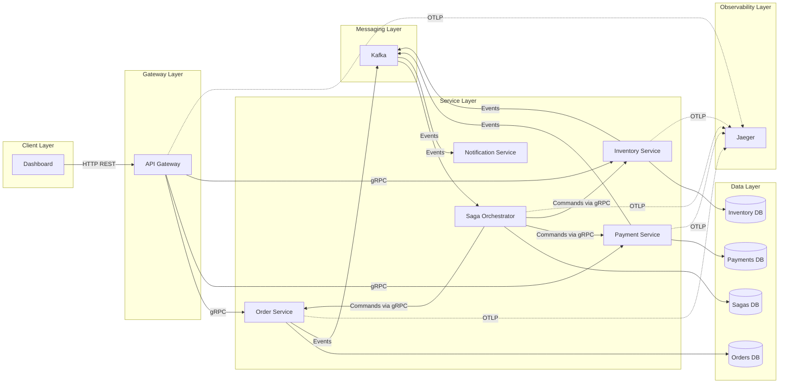
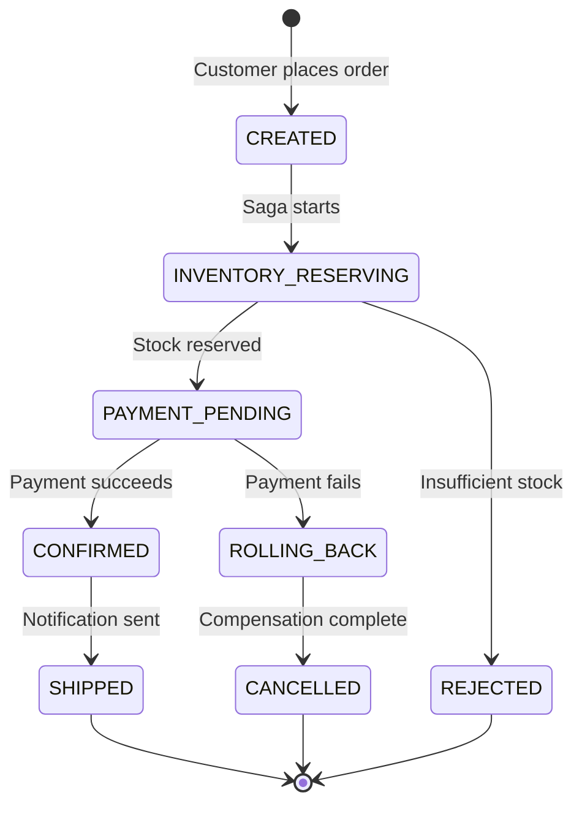
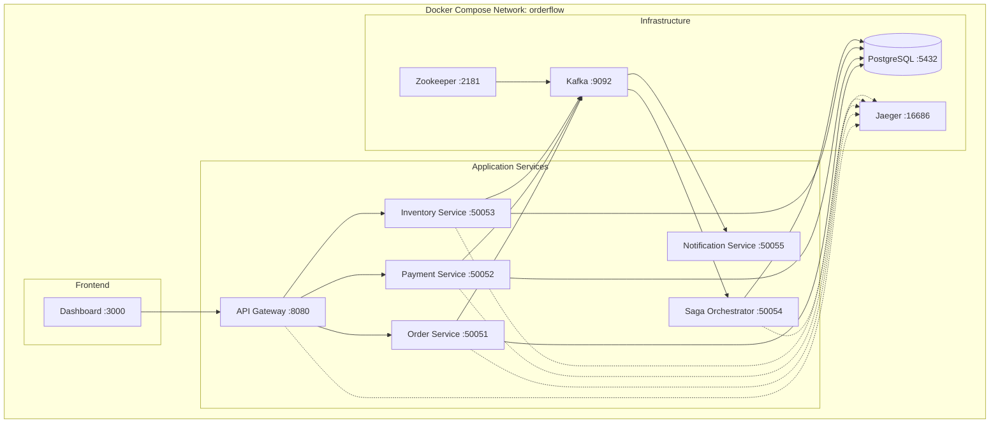

# Architecture Diagrams

## 1. System Architecture (High Level)

## 2. Saga Orchestration Flow (Happy Path)

## 3. Saga Failure & Compensation Flow

## 4. Data Flow Diagram

## 5. Order State Machine

## 6. Docker Compose Service Map

